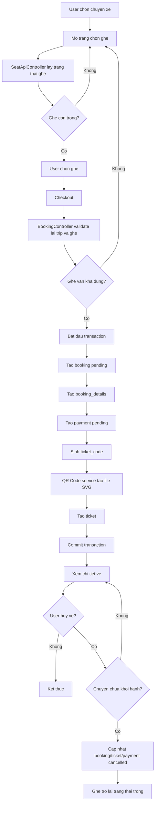
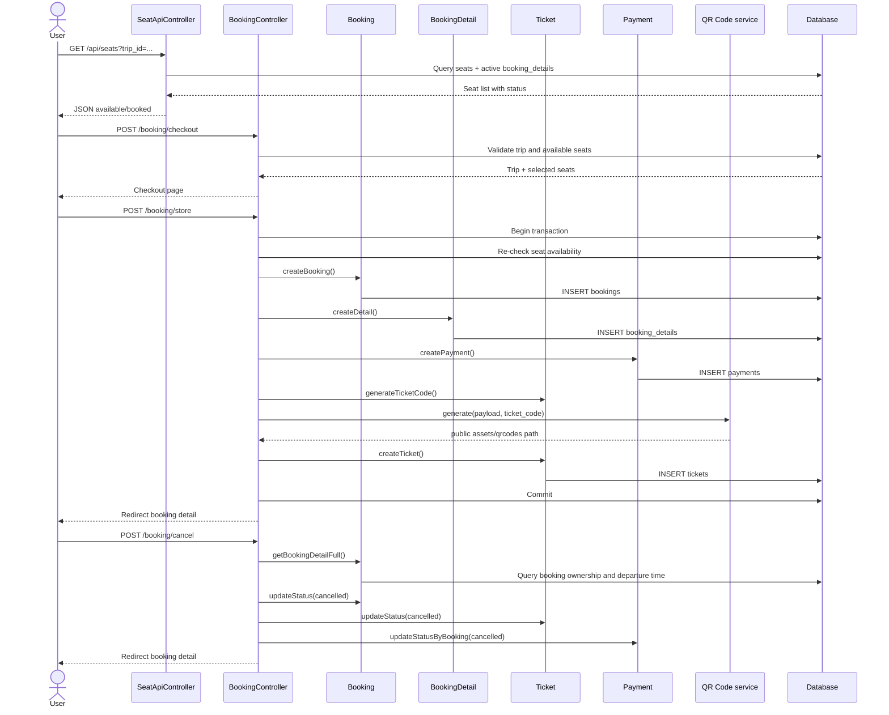

# Booking Module Diagrams

## Activity Diagram

```mermaid
flowchart TD
    A[User chon chuyen xe] --> B[Mo trang chon ghe]
    B --> C[SeatApiController lay trang thai ghe]
    C --> D{Ghe con trong?}
    D -- Khong --> B
    D -- Co --> E[User chon ghe]
    E --> F[Checkout]
    F --> G[BookingController validate lai trip va ghe]
    G --> H{Ghe van kha dung?}
    H -- Khong --> B
    H -- Co --> I[Bat dau transaction]
    I --> J[Tao booking pending]
    J --> K[Tao booking_details]
    K --> L[Tao payment pending]
    L --> M[Sinh ticket_code]
    M --> N[QR Code service tao file SVG]
    N --> O[Tao ticket]
    O --> P[Commit transaction]
    P --> Q[Xem chi tiet ve]
    Q --> R{User huy ve?}
    R -- Khong --> S[Ket thuc]
    R -- Co --> T{Chuyen chua khoi hanh?}
    T -- Khong --> Q
    T -- Co --> U[Cap nhat booking/ticket/payment cancelled]
    U --> V[Ghe tro lai trang thai trong]
```

## Sequence Diagram

```mermaid
sequenceDiagram
    actor User
    participant SeatApiController
    participant BookingController
    participant Booking
    participant BookingDetail
    participant Ticket
    participant Payment
    participant QR as QR Code service
    participant DB as Database

    User->>SeatApiController: GET /api/seats?trip_id=...
    SeatApiController->>DB: Query seats + active booking_details
    DB-->>SeatApiController: Seat list with status
    SeatApiController-->>User: JSON available/booked

    User->>BookingController: POST /booking/checkout
    BookingController->>DB: Validate trip and available seats
    DB-->>BookingController: Trip + selected seats
    BookingController-->>User: Checkout page

    User->>BookingController: POST /booking/store
    BookingController->>DB: Begin transaction
    BookingController->>DB: Re-check seat availability
    BookingController->>Booking: createBooking()
    Booking->>DB: INSERT bookings
    BookingController->>BookingDetail: createDetail()
    BookingDetail->>DB: INSERT booking_details
    BookingController->>Payment: createPayment()
    Payment->>DB: INSERT payments
    BookingController->>Ticket: generateTicketCode()
    BookingController->>QR: generate(payload, ticket_code)
    QR-->>BookingController: public assets/qrcodes path
    BookingController->>Ticket: createTicket()
    Ticket->>DB: INSERT tickets
    BookingController->>DB: Commit
    BookingController-->>User: Redirect booking detail

    User->>BookingController: POST /booking/cancel
    BookingController->>Booking: getBookingDetailFull()
    Booking->>DB: Query booking ownership and departure time
    BookingController->>Booking: updateStatus(cancelled)
    BookingController->>Ticket: updateStatus(cancelled)
    BookingController->>Payment: updateStatusByBooking(cancelled)
    BookingController-->>User: Redirect booking detail
```
